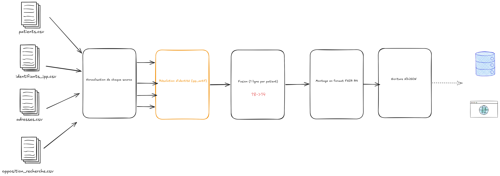

# Notes de rendu

Consolidation des quatre extractions en un référentiel `Patient` FHIR R4,
avec un job Spark unique et rejouable.

## Choix techniques

**PySpark plutôt que Scala.** Je suis à la date d'aujourd'hui beaucoup plus à l'aise en PySpark 
et vu la contrainte de temps je l'ai préféré à Scala.

**Sortie en NDJSON.** Le format de sortie était libre, à justifier « au regard de
l'usage API ». J'ai retenu le NDJSON (un objet JSON par ligne) : c'est le format
d'export *bulk* de FHIR, chaque ligne est une ressource `Patient` valide,
directement ingérable par un serveur / une API FHIR sans retraitement. Le fichier
est écrit en mode `overwrite`, ce qui rend le job **rejouable**.

## Structure du code

- `src/transformations.py` : la logique métier, sous forme de fonctions
  (nettoyage des sources, réconciliation d'identité,
  montage de la ressource FHIR).
- `src/build_patients.py` : l'orchestration (lecture des CSV, enchaînement des
  étapes, constitution des adresses et de l'opposition par fenêtrage, écriture
  NDJSON).

## Démarche



Le pipeline suit cinq étapes :

1. **Lecture** des quatre CSV.
2. **Normalisation** de chaque source isolément (dates, casse, types, booléens).
3. **Réconciliation d'identité** : chaque ligne reçoit un `ipp_actif` (l'IPP
   principal si l'IPP est déprécié, sinon lui-même), appliqué à toutes les tables.
4. **Fusion** : un enregistrement unique par patient réel, l'enregistrement actif
   faisant autorité pour l'identité, tous les IPP étant conservés.
5. **Montage FHIR** et écriture.

## Anomalies, hypothèses et arbitrages

Les données étant volontairement imparfaites, le tableau ci-dessous récapitule les
anomalies rencontrées et le traitement retenu. Les points qui relèvent d'un
**arbitrage** (et non d'un simple nettoyage) sont explicités juste après.

| Anomalie | Traitement |
|----------|------------|
| Formats de date hétérogènes (`AAAA-MM-JJ`, `JJ/MM/AAAA`, `JJ-MM-AAAA`, `AAAA/MM/JJ`) | Essai successif des formats, conversion en ISO |
| Sexe en formes variées (`M`, `F`, `1`, `2`, `Homme`, `male`…) | Table de correspondance vers `male` / `female` / `unknown` |
| Prénoms stockés en tableau JSON dans une chaîne, avec espaces parasites | Parsing JSON puis nettoyage de chaque élément |
| Casse incohérente des noms et libellés | Nom de naissance en majuscules ; prénoms, villes et libellés de voie en casse titre |
| Abréviations de voie (`bd`/`Boulevard`, `r.`/`rue`) | Développées via un dictionnaire non exhaustif |
| Statut d'IPP avec accents et casse variable | Passage en majuscules sans accent avant comparaison |
| IPP dépréciés rattachés à un IPP principal | Réattribution de toutes les données (identité, adresses, opposition) à l'IPP actif |
| Ligne patient dupliquée à l'identique (`800000124`) | Déduplication après normalisation |
| Deux enregistrements « actuels » identiques pour un patient (`800000127`) | Reconnus comme doublon (même adresse, deux périodes ouvertes) et fusionnés en gardant le plus récent ; l'historique clos (`800000126`) est préservé |
| IPP déprécié sans cible (`700000099`, absent des patients) | Écarté (pas d'IPP principal) |
| Opposition rattachée à un IPP inconnu (`800000199`) | Écarté naturellement par la jointure sur le référentiel patient |
| Booléens d'opposition hétérogènes (`O`, `oui`, `true`, `0`, `Opposé`…) | Conversion vers un booléen unique |
| Code postal invalide (`6900`) ou absent, adresse étrangère (Londres) | Conservés tels quels |

### Arbitrages notables

- **Identité de référence.** Quand un IPP déprécié et son principal coexistent,
  l'enregistrement **actif** fait foi pour l'identité ; tous les IPP sont conservés dans
  `identifier[]` (actif en `usual`, dépréciés en `old`).
- **Adresses.** L'adresse courante (`use: home`) est la plus récente (`date_debut`), les
  autres en `old` ; l'historique est conservé. Seuls les doublons **ouverts** (même adresse,
  sans date de fin) sont fusionnés, l'historique clos étant préservé.
- **Opposition.** Le recueil le plus récent fait foi ; portée via une **extension** FHIR,
  faute de champ natif.
- **Identifiant technique.** L'IPP actif sert de `id` technique de la ressource, distinct
  des identifiants métier listés dans `identifier[]`.
- **Champs manquants.** Simplement omis (cardinalité `0..1` en FHIR), jamais remplis d'une
  valeur inventée.

## Résultat

Les quatre sources (18 lignes patients, dont 3 IPP dépréciés et 1 doublon)
produisent **14 patients uniques**. Un échantillon complet est fourni dans
`sample_patients_fhir.ndjson`.

## Lancer le pipeline

```bash
python -m venv .venv && source .venv/bin/activate
pip install -r requirements.txt
./run.sh
```

Le résultat est écrit dans `output/patients_fhir/`.

## Avec plus de temps

- **Tests automatisés.** Des tests unitaires sur les fonctions de transformation
  (dates, sexe, réconciliation d'IPP) à partir de petits jeux de données, avec
  vérification du nombre de patients attendu.
- **Validation FHIR stricte.** Le job produit un JSON conforme à la structure
  `Patient`, mais ne le valide pas contre le profil officiel. Je le confronterais
  à une `StructureDefinition` (par exemple via un serveur HAPI FHIR ou la
  bibliothèque `fhir.resources`).
- **Écriture incrémentale.** À volume réel, l'`overwrite` complet ne tient pas.
  Je passerais sur une table Delta Lake avec un `MERGE` pour ne mettre à jour que
  les patients modifiés, ce qui apporte aussi transactions et historisation.
- **Qualité des données.** Marquer ou mettre en quarantaine les valeurs
  suspectes (code postal invalide, dates aberrantes) et exposer des compteurs
  d'anomalies, plutôt que de les laisser passer silencieusement.
- **Normalisation des adresses.** La normalisation du libellé de voie mérite un traitement
beaucoup plus robuste.